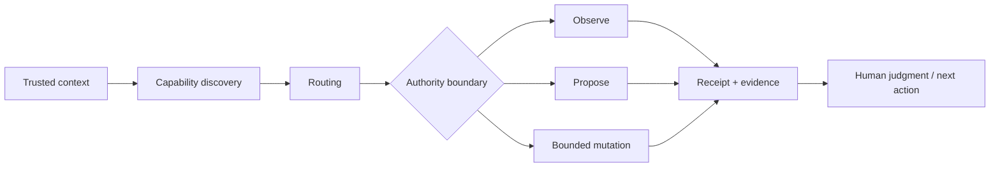

# Jared Silverman

**Growth systems leader who turns complex acquisition environments into scalable operating systems.**

I lead growth where media investment, conversion, measurement, agencies, technology, and executive decisions all have to work as one system. Across 15+ years, I have built and led performance organizations spanning PE-backed, enterprise, global, and high-growth environments.

My most recent enterprise work connected **$15M+ in media across 180+ institutions** with CRO, measurement architecture, agency governance, forecasting, internal capability building, and investment decisions. That work included a **$500K cross-market reallocation**, a separate **nine-school Meta-versus-paid-search allocation test**, agency RFP and partner-selection leadership, an in-house media capability built across three business units, and deeper platform-to-Salesforce signals used to optimize closer to applications and enrollments. Earlier work includes **$100M+ global programs**, **30+ person teams**, an acquisition rebuild that drove **~500% growth in approved applications**, and a measurement transformation that produced **86% YoY growth in web-qualified engagements while outperforming benchmarks by 3x**.

Over the last year, that operating work has expanded further into AI systems: capability discovery, agent routing, structured context, bounded execution, receipts, client interoperability, self-maintaining workflows, and privacy-safe publication. I use software and AI as operating infrastructure for growth, not as a separate technical identity.

## The 30-second read

- **Enterprise growth leadership:** $15M+ recent media scope across 180+ institutions, spanning investment strategy, performance media, CRO, measurement, partners, and executive decision support.
- **Transformation:** I step into fragmented growth environments, identify where performance is leaking, and build the operating model required to scale with more control.
- **Capital allocation:** I treat spend as investment, using downstream business signals to decide where capital should move, where it should be protected, and where activity should stop.
- **Operating leadership:** I build standards, decision rights, QA, reporting, agency accountability, and cadence so performance does not depend on individual heroics.
- **AI systems:** I build context-aware, capability-driven operating layers that make monitoring, synthesis, QA, execution, and recurring work more reliable without removing human authority.

**The throughline:** I do more than optimize campaigns. I design the system through which investment, conversion, measurement, execution, and accountability produce growth.

## Selected proof

| Leadership question | Evidence | What it demonstrates |
|---|---|---|
| Can he run a complex growth system at enterprise scale? | [Multi-Brand Education Growth System](https://github.com/silvermanjared-web/growth-architecture-os/blob/main/01-case-studies/pansophic-growth-system.md) | $15M+ media scope, 180+ institutions, capital allocation, forecasting, partner selection, capability building, measurement, CRO, and executive cadence |
| Can he rebuild acquisition performance? | [WEX App Growth Rebuild](https://github.com/silvermanjared-web/growth-architecture-os/blob/main/01-case-studies/wex-app-growth-rebuild.md) | ~500% growth in approved applications after a phased acquisition rebuild |
| Can he improve measurement and operating performance? | [FFIA Measurement Model](https://github.com/silvermanjared-web/growth-architecture-os/blob/main/01-case-studies/stand-together-ffia-measurement.md) | 86% YoY growth in web-qualified engagements and 3x benchmark outperformance |
| Can he translate marketing performance into investment judgment? | [Media Metrics to Financial Outcomes](https://github.com/silvermanjared-web/growth-architecture-os/blob/main/06-reference/media-metrics-to-financial-outcomes.md) | CAC, LTV, payback, incrementality, capital allocation, and decision logic |
| Is the AI work architectural rather than experimental? | [AI Operating System Reference](https://github.com/silvermanjared-web/growth-architecture-os/tree/main/04-ai-systems/ai-operating-system-reference) | Capability discovery, bounded execution, receipts, interoperability, smoke tests, unit tests, security tests, and minimum necessary governance |
| Can he turn that architecture into usable operating systems? | [Marketing Intelligence Agent](https://github.com/silvermanjared-web/marketing-intelligence-agent) + [Marketing Ops Toolkit](https://github.com/silvermanjared-web/marketing-ops-toolkit) | Agent routing, source-aware synthesis, deterministic checks, platform workflows, and bounded mutation |

## Public operating-system portfolio

The portfolio is intentionally small. Each repository has a distinct role.

1. **[Growth Architecture OS](https://github.com/silvermanjared-web/growth-architecture-os)** — the flagship. Growth leadership, capital allocation, operating models, case studies, playbooks, and the canonical AI operating-system reference.
2. **[Marketing Intelligence Agent](https://github.com/silvermanjared-web/marketing-intelligence-agent)** — the intelligence layer. Source-aware synthesis, explicit capabilities, agent routing, state-aware workflows, receipts, and client interoperability.
3. **[Marketing Ops Toolkit](https://github.com/silvermanjared-web/marketing-ops-toolkit)** — the execution layer. Deterministic checks, real marketing utilities, and five bounded mutation contracts.
4. **[Private-to-Public Release Gate](https://github.com/silvermanjared-web/private-to-public-release-gate)** — the publication boundary. A Go implementation for privacy scanning, explicit export decisions, reviewed overlays, and Git-aware drift control.
5. **[AI Context & Design System](https://github.com/silvermanjared-web/brand-context-system)** — the context-to-implementation layer. Structured brand and design context, extraction, tokens, CSS, component contracts, and validation.
6. **[Marketing Ops Playbooks](https://github.com/silvermanjared-web/marketing-ops-playbooks)** — the method layer. Reusable operating knowledge for taxonomy, data quality, funnel QA, performance diagnostics, and growth operations.

The older [Brand Design System Starter](https://github.com/silvermanjared-web/brand-design-system-starter) remains public as a historical implementation reference but is no longer a primary portfolio entry point.

## AI operating-system point of view

The [AI Operating System Reference](https://github.com/silvermanjared-web/growth-architecture-os/tree/main/04-ai-systems/ai-operating-system-reference) distills the architecture I use across larger private systems into a public-safe reference.

The operating principles are straightforward:

- simplify first;
- make the basic path work end to end;
- expose real capabilities rather than implied abilities;
- automate ordinary work without repeated permission loops;
- constrain mutation at the capability boundary;
- return evidence after execution;
- build health, cleanup, and maintenance into normal operation;
- add only the governance required to contain actual risk.

## Operating point of view

- Spend is capital allocation, not campaign management.
- Growth improves when investment, conversion, measurement, execution, and accountability operate as one system.
- Reporting should end in a decision, an owner, or a clearly named information gap.
- Governance should increase operating leverage, not add ceremony.
- Agencies should be managed against business outcomes, explicit standards, and clear decision rights.
- AI should compound judgment and repeatability, not create a second operating bureaucracy.

## Why this portfolio exists

A résumé can summarize scope and outcomes. This portfolio shows the operating thinking behind them: how I diagnose, prioritize, allocate, govern, communicate, and build systems other people and AI agents can run.

The public repos intentionally expose reusable patterns rather than private systems, personal data, private integrations, or environment-specific infrastructure. Where private-derived work is published, the [Private-to-Public Release Gate](https://github.com/silvermanjared-web/private-to-public-release-gate) demonstrates the boundary discipline behind that process.

The underlying business claims are governed through the [Growth Architecture OS claim system](https://github.com/silvermanjared-web/growth-architecture-os/tree/main/00-positioning/claims).

Usage and rights: this portfolio is public for professional review, not open-source reuse. See [USAGE.md](USAGE.md).